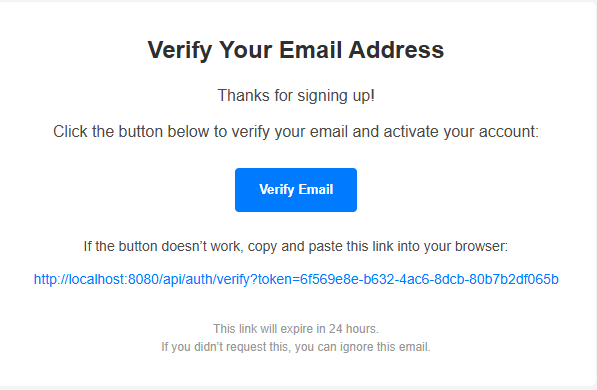

# Authentication API

A Spring Boot application that provides JWT-based authentication, including user registration, login, and password recovery with email notifications.

---

## Prerequisites

- Java 17
- Docker & Docker Compose

---

## Running with Docker Compose

1. Clone the repository:
   ```bash
   git clone https://github.com/your-username/auth-api.git
   ```
2. Navigate to the project directory:
   ```bash
   cd auth-api
   ```
3. Start the containers:
   ```bash
   docker-compose up -d
   ```

This will start the following services:

- PostgreSQL – accessible on port 5432
- pgAdmin – accessible on http://localhost:5050
- AuthAPI – available on port 8080

---

## Database Access (pgAdmin)

Login Credentials:
- Email: admin@admin.com
- Password: admin

To connect to PostgreSQL:
- Host: postgres
- Port: 5432
- Database: auth_db
- Username: postgres
- Password: admin

---

## API Endpoints

### Registration
```
POST /api/auth/register
```

Request Body:
```json
{
  "username": "testuser",
  "password": "Password123!",
  "email": "test@example.com"
}
```

### Login
```
POST /api/auth/login
```

Request Body:
```json
{
  "username": "testuser",
  "password": "Password123!"
}
```

---

## Environment Configuration

Environment variables are defined in the `.env` file, including:

- PostgreSQL database configuration
- JWT secret and expiration
- Server port

---

## Running Locally (without Docker)

1. Ensure PostgreSQL is running locally.
2. Update the `src/main/resources/application.properties` file with your local DB credentials.
3. Run the application:
   ```bash
   ./mvnw spring-boot:run
   ```

---

## Building the Application

```bash
./mvnw clean package
```

This will generate a JAR file in the `target/` directory.

---

## Security Configuration

Located in `WebSecurityConfig.java`, this class:

- Secures all API endpoints using JWT
- Configures CORS and CSRF settings
- Sets up custom authentication and authorization providers

---

## Email Notifications

After successful registration, a confirmation email is automatically sent to the user's email address.

