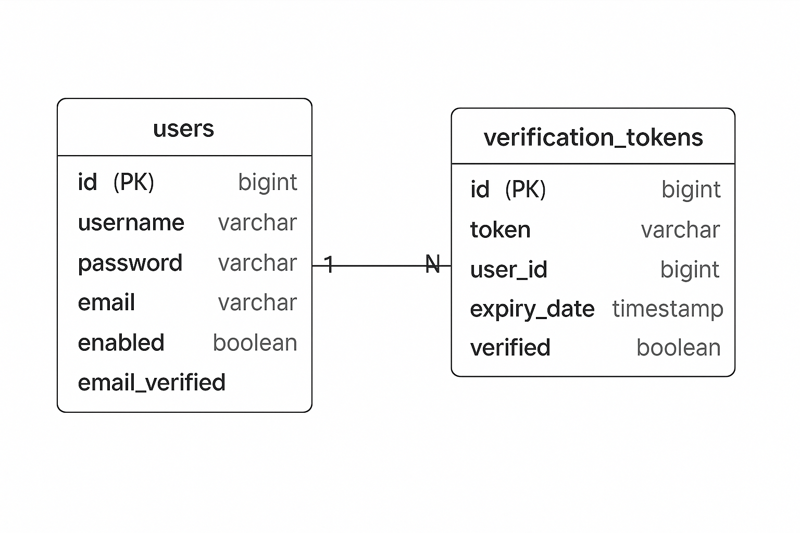

# API de Autenticação

[](https://www.oracle.com/java/)
[](https://spring.io/projects/spring-boot)
[](https://www.postgresql.org/)
[](https://www.rabbitmq.com/)
[](https://www.docker.com/)
[](https://maven.apache.org/)
[](https://github.com/jwtk/jjwt)
[](https://www.passay.org/)
[](https://bucket4j.com/)

Uma aplicação Spring Boot que fornece autenticação baseada em JWT, incluindo registro de usuário, login, verificação de e-mail e recuperação de senha com notificações por e-mail.

## Funcionalidades

- Registro de Usuário com Verificação de E-mail
- Autenticação baseada em JWT
- Fluxo de Recuperação de Senha
- Notificações por E-mail
- Integração com Banco de Dados PostgreSQL
- Suporte a Docker
- Documentação da API

## Arquitetura do Sistema



---

## Pré-requisitos

- Java 17
- Docker & Docker Compose
- PostgreSQL (se executando localmente)

---

## Executando com Docker Compose

1.  Clone o repositório:
    ```bash
    git clone https://github.com/your-username/auth-api.git
    ```
2.  Navegue até o diretório do projeto:
    ```bash
    cd auth-api
    ```
3.  Inicie os contêineres:
    ```bash
    docker-compose up -d
    ```

Isto iniciará os seguintes serviços:

-   **PostgreSQL** – acessível na porta `5432`
-   **pgAdmin** – acessível em `http://localhost:5050`
-   **AuthAPI** – disponível na porta `8080`

---

## Acesso ao Banco de Dados (pgAdmin)

**Credenciais de Login:**

-   **Email:** `admin@admin.com`
-   **Senha:** `admin`

**Para conectar ao PostgreSQL:**

-   **Host:** `postgres`
-   **Porta:** `5432`
-   **Banco de Dados:** `auth_db`
-   **Usuário:** `postgres`
-   **Senha:** `admin`

---

## Endpoints da API

### 1. Registro de Usuário

```http
POST /api/auth/register
```

Registra um novo usuário e envia um e-mail de verificação.

**Corpo da Requisição:**

```json
{
    "username": "guilherme",
    "password": "Guilherme@123!",
    "email": "guilherme@gmail.com"
}
```

### 2. Login de Usuário

```http
POST /api/auth/login
```

Autentica um usuário e retorna um token JWT.

**Corpo da Requisição:**

```json
{
    "email": "guilherme@gmail.com",
    "password": "Guilherme@123!"
}
```

### 3. Esqueceu a Senha

```http
POST /api/auth/forgot-password?email=guilherme@gmail.com
```

Solicita um link de redefinição de senha por e-mail.

### 4. Redefinir Senha

```http
POST /api/auth/reset-password
```

Redefine a senha usando o token recebido por e-mail.

**Corpo da Requisição:**

```json
{
    "email": "guilherme@gmail.com",
    "token": "seu-token-de-reset",
    "newPassword": "NovaSenha@2024!"
}
```

### 5. Verificação de E-mail

```http
GET /api/auth/verify-email?token=seu-token-de-verificacao
```

Verifica o endereço de e-mail do usuário usando o token recebido.

### 6. Reenviar E-mail de Verificação

```http
POST /api/auth/resend-verification?email=guilherme@gmail.com
```

Solicita um novo e-mail de verificação.

### 7. Verificação de Saúde (Health Check)

```http
GET /api/auth/health
```

Verifica o status da API.

---

## Exemplos de Notificação por E-mail

### E-mail de Confirmação de Registro


### Verificação de E-mail


### Solicitação de Redefinição de Senha


### Confirmação de Redefinição de Senha


---

## Configuração de Ambiente

As variáveis de ambiente são definidas no arquivo `.env`, incluindo:

-   Configuração do banco de dados PostgreSQL
-   Segredo e tempo de expiração do JWT
-   Porta do servidor
-   Configuração do serviço de e-mail
-   Configurações do RabbitMQ

---

## Executando Localmente (sem Docker)

1.  Certifique-se de que o PostgreSQL está rodando localmente.
2.  Atualize o arquivo `src/main/resources/application.properties` com as credenciais do seu banco de dados local.
3.  Execute a aplicação:
    ```bash
    ./mvnw spring-boot:run
    ```

---

## Construindo a Aplicação

```bash
./mvnw clean package
```

Isso irá gerar um arquivo JAR no diretório `target/`.

---

## Funcionalidades de Segurança

-   Autenticação baseada em JWT
-   Criptografia de senha usando BCrypt
-   Verificação de e-mail
-   Redefinição de senha baseada em token
-   Proteção contra CORS e CSRF
-   Limitação de taxa de requisições (Rate Limiting)
-   Validação de senha segura

---

## Json das Requisições

Uma coleção completa do Postman está disponível no arquivo `exemplos/auth-collection.json`. Importe esta coleção no Postman para testar todos os endpoints disponíveis.

---
